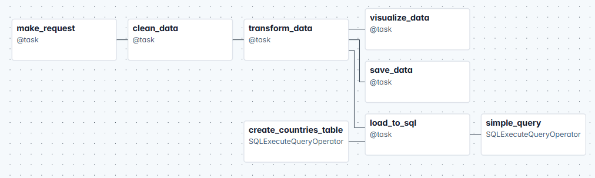
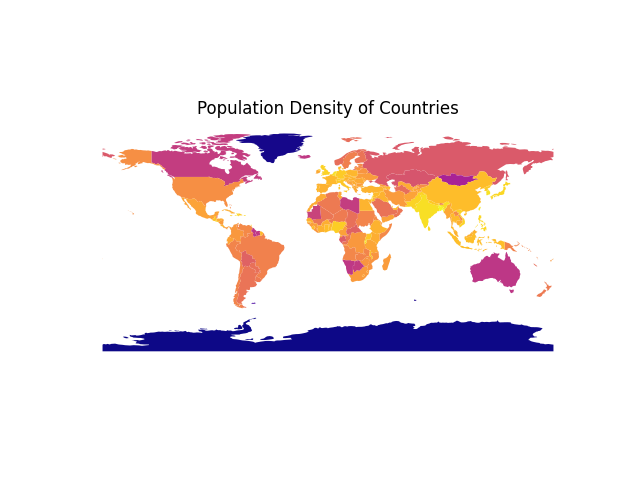

# Geo-Airflow
In this project, I implemented a simple ETL pipeline using Apache Airflow to process and visualize population density data. I also utilized the modern Airflow TaskAPI (`@task`, `@dag`) for the process.

The DAG is straightforward ensuring that the data is requested, processed, then saved. The final `pandas` dataframe is then loaded to a SQLite database. The final query provides an aggregate of the average population density of the continents.

*Attribution*: Geographical data from [RestCountries](https://restcountries.com/).

  

  <em>Figure 1: DAG visualization in Apache Airflow showing the ETL process.</em>

  

  <em>Figure 1: Population Density visualization; The lighter the hue, the larger the population density.</em>
